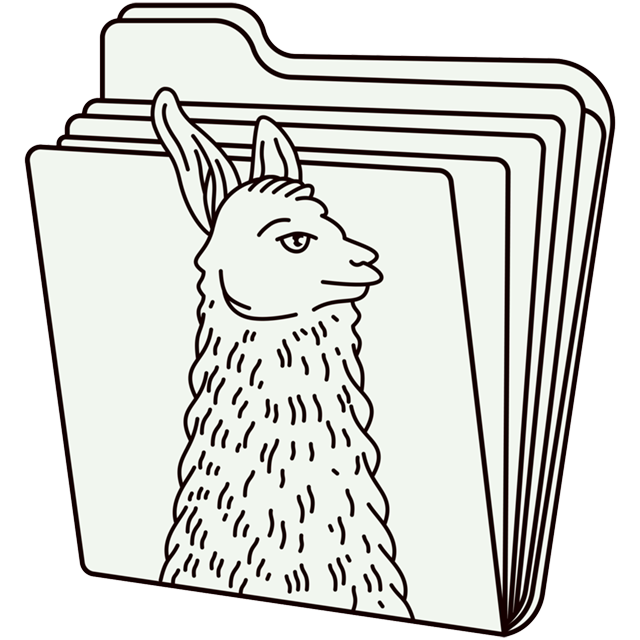

# llamafile

> **We want to hear from you!**
Mozilla.ai recently adopted the llamafile project, and we're planning an approach for codebase modernization. Please share what you find most valuable about llamafile and what would make it more useful for your work.
[Read more via the blog](https://blog.mozilla.ai/llamafile-returns/) and add your voice to the discussion [here](https://github.com/mozilla-ai/llamafile/discussions/809).

[](https://github.com/Mozilla-Ocho/llamafile/actions/workflows/ci.yml)
[](https://discord.gg/YuMNeuKStr)



**llamafile lets you distribute and run LLMs with a single file.** ([announcement blog post](https://hacks.mozilla.org/2023/11/introducing-llamafile/))

Our goal is to make open LLMs much more accessible to both developers and end users. We're doing that by combining [llama.cpp](https://github.com/ggerganov/llama.cpp) with [Cosmopolitan Libc](https://github.com/jart/cosmopolitan) into one framework that collapses all the complexity of LLMs down to a single-file executable (called a "llamafile") that runs locally on most computers, with no installation.

<a href="https://builders.mozilla.org/"></a>
llamafile is a <a href="https://builders.mozilla.org/">Mozilla Builders</a> project.

## What makes llamafile special?

llamafile combines llama.cpp with Cosmopolitan Libc to provide some unique capabilities:

1. **Multiple CPU microarchitectures** - llamafiles can run on multiple CPU microarchitectures. We added runtime dispatching to llama.cpp that lets new Intel systems use modern CPU features without trading away support for older computers.

2. **Multiple CPU architectures** - llamafiles can run on multiple CPU architectures. We do that by concatenating AMD64 and ARM64 builds with a shell script that launches the appropriate one. Our file format is compatible with WIN32 and most UNIX shells.

3. **Six operating systems** - llamafiles can run on macOS, Windows, Linux, FreeBSD, OpenBSD, and NetBSD. If you make your own llamafiles, you'll only need to build your code once, using a Linux-style toolchain.

4. **Embedded weights** - The weights for an LLM can be embedded within the llamafile. We added support for PKZIP to the GGML library. This lets uncompressed weights be mapped directly into memory, similar to a self-extracting archive.

5. **Create your own** - With the tools included in this project you can create your *own* llamafiles, using any compatible model weights you want. You can then distribute these llamafiles to other people, who can easily make use of them regardless of what kind of computer they have.

## Get started

Ready to try llamafile? Head over to the [Quickstart](quickstart.md) to download and run your first llamafile in minutes.

## Supported platforms

### Operating Systems

llamafile supports the following operating systems, which require a minimum stock install:

- Linux 2.6.18+ (i.e. every distro since RHEL5 c. 2007)
- Darwin (macOS) 23.1.0+ (GPU is only supported on ARM64)
- Windows 10+ (AMD64 only)
- FreeBSD 13+
- NetBSD 9.2+ (AMD64 only)
- OpenBSD 7+ (AMD64 only)

### CPUs

llamafile supports the following CPUs:

- **AMD64** microprocessors must have AVX. Otherwise llamafile will print an error and refuse to run. This means that if you have an Intel CPU, it needs to be Intel Core or newer (circa 2006+), and if you have an AMD CPU, then it needs to be K8 or newer (circa 2003+). Support for AVX512, AVX2, FMA, F16C, and VNNI are conditionally enabled at runtime if you have a newer CPU.

- **ARM64** microprocessors must have ARMv8a+. This means everything from Apple Silicon to 64-bit Raspberry Pis will work, provided your weights fit into memory.

### GPUs

llamafile supports the following kinds of GPUs:

- Apple Metal
- NVIDIA
- AMD

See the [GPU Support](gpu-support.md) page for detailed information on GPU acceleration.

## New v2 Server

We have a new server that has a better web GUI. It also implements OpenAI API compatible endpoints, including embeddings. It's designed to be more reliable and better able to recycle context windows across multiple slots. To try it, run:

```sh
llamafile --server --v2 --help
llamafile --server --v2
```

## Security

llamafile adds pledge() and SECCOMP sandboxing to llama.cpp. This is enabled by default. It can be turned off by passing the `--unsecure` flag. Sandboxing is currently only supported on Linux and OpenBSD on systems without GPUs; on other platforms it'll simply log a warning.

Our approach to security has these benefits:

1. After it starts up, your HTTP server isn't able to access the filesystem at all. This is good, since it means if someone discovers a bug in the llama.cpp server, then it's much less likely they'll be able to access sensitive information on your machine or make changes to its configuration.

2. The main CLI command won't be able to access the network at all. This is enforced by the operating system kernel. It also won't be able to write to the file system.

Therefore your llamafile is able to protect itself against the outside world, but that doesn't mean you're protected from llamafile. Sandboxing is self-imposed. If you obtained your llamafile from an untrusted source then its author could have simply modified it to not do that.

## A note about models

The example llamafiles provided in this documentation should not be interpreted as endorsements or recommendations of specific models, licenses, or data sets on the part of Mozilla.

## Licensing

While the llamafile project is Apache 2.0-licensed, our changes to llama.cpp are licensed under MIT (just like the llama.cpp project itself) so as to remain compatible and upstreamable in the future, should that be desired.

The llamafile logo on this page was generated with the assistance of DALL·E 3.

[](https://star-history.com/#Mozilla-Ocho/llamafile&Date)
